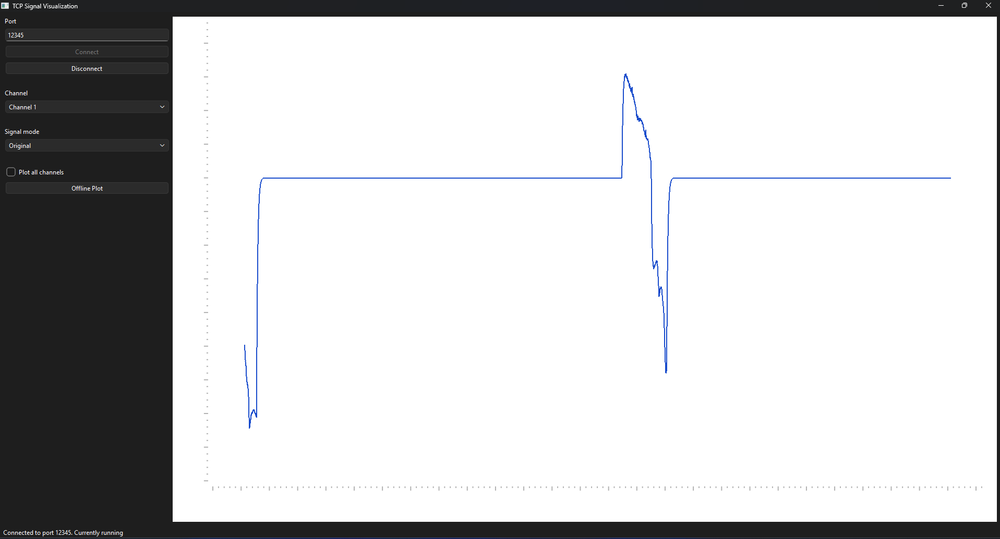

# TCP Signal Visualization Application

A **PySide6** desktop application for **live visualization** (VisPy) and **offline inspection** (Matplotlib) of multi-channel EMG data streamed over TCP, built using the **Model–View–ViewModel (MVVM)** architecture.

> **Group:** 2

| Team Member     | Responsibility                                                                             |
| --------------- | ------------------------------------------------------------------------------------------ |
| **Rayan Adam**  | TCP backend (`models/`)                                                                    |
| **Hemant**      | Visualization / frontend (`views/`)                                                        |
| **Yassin Radi** | Documentation, integration (`viewmodels/`, `main.py`, `models/config.py`, README, tooling) |

---

## Screenshot

> *(Add a screenshot here after uploading one to the repository.)*





---

## Features

* Live TCP streaming from an EMG server
* Real-time visualization with **VisPy**
* Offline signal analysis with **Matplotlib**
* Support for **32 EMG channels**
* Original, Filtered and RMS signal modes
* Rolling 10-second data buffer
* MVVM software architecture
* Automatic packet reconstruction and buffering
* Error handling for common connection problems

---

## TCP Backend

The TCP backend provides:

* TCP socket connection
* Byte buffer management
* Packet reconstruction
* Rolling buffer (10 seconds)
* `float64` signal data
* 32 channels
* 18 samples per packet

---

## Installation

Requires **Python 3.10** or newer.

```bash
python -m venv .venv
source .venv/bin/activate      # Windows: .venv\Scripts\activate
pip install -r requirements.txt
```

All required dependencies are listed in `requirements.txt`.

---

## Running the Application

1. Start the TCP server from **Exercise 5**.
2. Launch the application:

```bash
python main.py
```

3. Enter the TCP server port into the **TCP Port** field.
4. Press **Connect** to begin streaming.
5. Press **Disconnect** to stop streaming.

> **Note:**
> `SAMPLE_RATE` in `models/config.py` must match the sampling rate used by the TCP server because it is used for both the time axis and the signal processing filters.

---

## Live Visualization (VisPy)

The live plot continuously displays the **last 10 seconds** of streamed EMG data.

Available options:

* **Channel** – Select one of the 32 channels.
* **Signal Mode** – Original, Filtered or RMS.
* **Plot All Channels** – Displays all 32 channels simultaneously using vertical offsets to prevent overlap.

---

## Offline Visualization (Matplotlib)

After disconnecting from the server, the complete recording can be inspected using Matplotlib.

The offline viewer allows you to:

* Select any recorded channel
* Switch between Original, Filtered and RMS modes
* Display all channels simultaneously
* Refresh the visualization after changing settings

Unlike the live plot, the offline plot only updates when **Refresh** is pressed.

---

## Signal Processing

The processing pipeline follows the implementation from **Exercise 2**.

| Mode         | Description                                                                          |
| ------------ | ------------------------------------------------------------------------------------ |
| **Original** | Displays the raw signal without processing.                                          |
| **Filtered** | Fourth-order Butterworth band-pass filter (20–450 Hz) using `filtfilt`.              |
| **RMS**      | Applies the Butterworth filter first, followed by a moving RMS with a 100 ms window. |

The RMS is always calculated from the **filtered** signal. Filtering removes the DC offset before RMS computation, producing a more meaningful envelope of the EMG signal.

---

## Project Structure (MVVM)

```text
main.py
│
├── models/
│   ├── config.py
│   ├── signal_processor.py
│   └── tcp_client_model.py
│
├── viewmodels/
│   └── main_viewmodel.py
│
└── views/
    ├── main_window.py
    ├── matplotlib_window.py
    └── vispy_plot_widget.py
```

### Layer Responsibilities

**Model**

* TCP communication
* Packet reconstruction
* Signal processing
* Application configuration

**ViewModel**

* Connects the GUI with the backend
* Transfers data between Model and View
* Exposes Qt signals and application logic

**View**

* Contains only GUI code
* Displays data
* Never communicates directly with the TCP backend

`main.py` is responsible for connecting all three layers.

---

## Error Handling

The application reports errors in the status bar instead of terminating unexpectedly.

Handled situations include:

* Invalid TCP port
* Server unavailable
* Connection lost during streaming
* Attempting to open the offline viewer before any data has been recorded

---

## Technologies

* Python
* PySide6
* VisPy
* Matplotlib
* NumPy
* SciPy
* TCP Sockets
* MVVM Architecture
